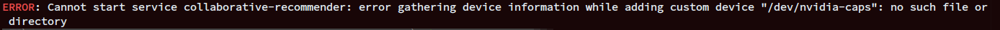

## Prerequisites

### Setup your host machine
This step is required for your host machine. You gotta make sure all the following requirement are satisfied
+ Nvidia proprietary version >= 410
+ Blacklist nouveau module
  ```bash
    sudo mkdir -p /etc/modprobe.d;
    sudo touch /etc/modprobe.d/blacklist-nouveau.conf;
    sudo echo "blacklist nouveau" >> /etc/modprobe.d/blacklist-nouveau.conf;
    sudo echo "options nouveau modeset=0" >> /etc/modprobe.d/blacklist-nouveau.conf;

  ```
+ Docker engine version >= 19.03. From this version, docker natively support GPU
+ If you have `nvidia-docker` or `nvidia-docker2` installed, remove it. According to nvidia these are deprecated. Find a way yourself to install `nvidia-container-toolkit` OR `nvidia-container-runtime`. Just install it, we'll talk about configuration later on.
### Download container required packages
Download all specified packages and put them in this directory, inside `/download`
<br>

<div class="warning">


**Note:**
You need a nvidia membership account download.

Choose between 2 image. Definitely check the Dockerfile, there's more specific packages version. If you want Tensorflow 1x, go for cuda10, for Tensorflow 2x, go for cuda11
1. ubuntu-18.04-cuda10-cudnn7
2. ubuntu-18.04-cuda11-cudnn8

For `ubuntu-18.04-cuda11-cudnn8`
</div>

|Packages|Url|
|---|---|
|CUDA 11.2.2 RUN file (Linux, x86_64, Ubuntu, 18.04) |https://developer.nvidia.com/cuda-11.2.2-download-archive|
|cuDNN 8.2.1 for CUDA 11.x (Runtime, Developer, Code Samples)|https://developer.nvidia.com/rdp/cudnn-archive|
|TensorRT 8.2.0.6 (Linux x86_64 CUDA11.2 TAR)|https://developer.nvidia.com/nvidia-tensorrt-8x-download|
|NGC Cli (Download CLI)|https://ngc.nvidia.com/setup/installers/cli|

For `ubuntu-18.04-cuda10-cudnn7`
</div>

|Packages|Url|
|---|---|
|CUDA 10.0.130 RUN file (Linux, x86_64, Ubuntu, 18.04) |https://developer.nvidia.com/cuda-10.0-download-archive|
|cuDNN 7.6.5 for CUDA 10.0 (Runtime, Developer, Code Samples)|https://developer.nvidia.com/rdp/cudnn-archive|
|TensorRT 7.0.0.11 (Ubuntu 18.04 CUDA 10.0 TAR)|https://developer.nvidia.com/nvidia-tensorrt-7x-download|
|NGC Cli (Download CLI)|https://ngc.nvidia.com/setup/installers/cli|

## Step 1: Build CUDA image

The CUDA image require interactive installation. The dockerfile is just setup some pre-requisite packages and download repos. Right after you build the image, perform `docker run -it ` and execute `/install-cuda*.sh` by your self. After installation, create new terminal and perform `docker commit` to create image from running docker, tag it whatever you want. And we done, use this CUDA image as the base for tensorRT image.
<br>
<br>
While installation, there's a time when terminal display a term and agreement. To quickly navigate to to bottom, hold `s`. Till you reach the bottom, follow the instruction, input options as below

  

Basically the installation UI might be a little bit different. Just remember to **INSTALL ALL CUDA RELATED, ONLY EXCEPT NVIDIA DRIVER**

## Step 2: Build tensorRT image

Choose your tensorRT base on this metric
|CUDA|TensorRT|
|---|---|
|CUDA10.0|TensorRT 7.0.0|
|CUDA11.2.2|TensorRT 8.2.0|

Build you chosen tensorRT, remember to replace `FROM` in the dockerfile with your pre-built CUDA image

## Step 3: Configure your host machine
### For both `nvidia-container-toolkit` or `nvidia-container-runtime`
Basically you don't have to to anything, but if did messed up with some default config. Here's how to revert it properly.
<br><br>
Edit your `/etc/nvidia-container-runtime/config.toml`
```bash
disable-require = false
#swarm-resource = "DOCKER_RESOURCE_GPU"
#accept-nvidia-visible-devices-envvar-when-unprivileged = true
#accept-nvidia-visible-devices-as-volume-mounts = false

[nvidia-container-cli]
#root = "/run/nvidia/driver"
#path = "/usr/bin/nvidia-container-cli"
environment = []
#debug = "/var/log/nvidia-container-toolkit.log"
#ldcache = "/etc/ld.so.cache"
load-kmods = true
no-cgroups = true # by pass cgroup. 
# By ignore cgroup, we allocate machine resource on our own

#user = "root:video"
ldconfig = "@/sbin/ldconfig"

[nvidia-container-runtime]
#debug = "/var/log/nvidia-container-runtime.log"
```
<br>

Remove `systemd.unified_cgroup_hierachy=false` from `/proc/cmdline`.
<br>
<br>

### Additional step for `nvidia-container-runtime`, 

Edit your `/etc/docker/daemon.json`
```json
{
    "data-root": "/virtual/data/docker", // just by personal, please ignore
    "runtimes": {
	"nvidia": {
	    "path": "/usr/bin/nvidia-container-runtime",
	    	"runtimeArgs": []
	}
    }
}
```

### Restart docker service
```bash
sudo systemctl restart docker
```

## Step 4: Run the container
I assume your tensorRT image is tagged as `tensorRT-TF:latest`

### For `nvidia-container-toolkit`
A single docker run
```bash
docker run --rm --gpus all \
	--device /dev/nvidia-caps \
	--device /dev/nvidia0 \
	--device /dev/nvidiactl \
	--device /dev/nvidia-modeset  \
	--device /dev/nvidia-uvm \
	--device /dev/nvidia-uvm-tools \
        -e NVIDIA_VISIBLE_DEVICES=all \
        -e NVIDIA_DRIVER_CAPABILITIES=compute,utility \
	\
	tensorRT-TF:latest nvidia-smi

```
A compose file
```yaml
version: "3.9"

services:

    nvidia-startup:
        image: tensorRT-TF:latest
        devices:
            - /dev/nvidia0:/dev/nvidia0
            - /dev/nvidiactl:/dev/nvidiactl
            - /dev/nvidia-caps:/dev/nvidia-caps
            - /dev/nvidia-modeset:/dev/nvidia-modeset
            - /dev/nvidia-uvm:/dev/nvidia-uvm
            - /dev/nvidia-uvm-tools:/dev/nvidia-uvm-tools
        environment:
            - NVIDIA_VISIBLE_DEVICES=all
            - NVIDIA_DRIVER_CAPABILITIES=compute,utility

        deploy:
            resources:
                reservations:
                    devices:
                        - driver: nvidia
                            capabilities: [gpu]
        entrypoint: ["nvidia-smi"]
```
If you run container with privileged mode, you don't have to type all the devices as with privileged mode, docker have access to all your host machine devices. So a compose file should look like this
```yaml
version: "3.9"

services:

    nvidia-startup:
        image: tensorRT-TF:latest
        privileged: true

        environment:
            - NVIDIA_VISIBLE_DEVICES=all
            - NVIDIA_DRIVER_CAPABILITIES=compute,utility

        deploy:
            resources:
                reservations:
                    devices:
                        - driver: nvidia
                            capabilities: [gpu]
        entrypoint: ["nvidia-smi"]
```

### For `nvidia-container-runtime`
A single docker run
```bash
docker run --rm --runtime nvidia \
	--device /dev/nvidia-caps \
	--device /dev/nvidia0 \
	--device /dev/nvidiactl \
	--device /dev/nvidia-modeset  \
	--device /dev/nvidia-uvm \
	--device /dev/nvidia-uvm-tools \
        -e NVIDIA_VISIBLE_DEVICES=all \
        -e NVIDIA_DRIVER_CAPABILITIES=compute,utility \

	\
	tensorRT-TF:latest nvidia-smi
```
A compose file
```yaml
version: "3.9"

services:
    nvidia-startup:
        image: tensorRT-TF:latest
        runtime: nvidia

        environment:
            - NVIDIA_VISIBLE_DEVICES=all
            - NVIDIA_DRIVER_CAPABILITIES=compute,utility

        devices:
            - /dev/nvidia0:/dev/nvidia0
            - /dev/nvidiactl:/dev/nvidiactl
            - /dev/nvidia-caps:/dev/nvidia-caps
            - /dev/nvidia-modeset:/dev/nvidia-modeset
            - /dev/nvidia-uvm:/dev/nvidia-uvm
            - /dev/nvidia-uvm-tools:/dev/nvidia-uvm-tools
        entrypoint: ["nvidia-smi"]
```
Again if you run container with privileged mode, you don't have to type all the devices. So a compose file should look like this
```yaml
version: "3.9"

services:
    nvidia-startup:
        image: tensorRT-TF:latest
        runtime: nvidia
        privileged: true

        environment:
            - NVIDIA_VISIBLE_DEVICES=all
            - NVIDIA_DRIVER_CAPABILITIES=compute,utility


        entrypoint: ["nvidia-smi"]
```

## Errors?

### Nvidia device error



This occur due to nvidia being not fully generated all dev files required for container. Solution is easy, just run this code in your terminal
```bash
sudo docker run --rm --gpus all nvidia/cuda:11.0-base nvidia-smi
```
This code will very likely throw initialize NVML error. Well ignore this, why? Because the above code, it's goal is not to be ran successfully, but the real target is to activate the nvidia run time hook. That hook will initialize all required nvidia dev files.
### For other errors
First, please make sure you have read through this readme properly, don't just copy paste. Otherwise create an issue on this github, i'll have a look real quick.
